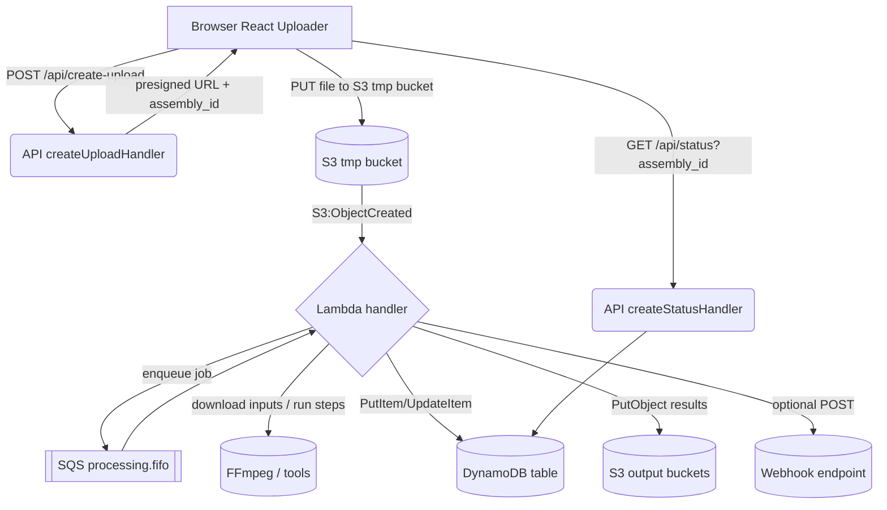

### Transflow

Production-ready serverless file processing pipelines on AWS with S3 + SQS + Lambda + DynamoDB, plus a React uploader.

### Features

- Explicit, templated processing steps (FFmpeg or any binaries)
- Secure upload to a temp S3 bucket (pre-signed PUT)
- SQS-based concurrency and batching
- Status tracking in DynamoDB with optional webhook
- React `<Uploader>` and `<TransflowProvider>` client
- GitHub Actions baked-in for deploy/cleanup

### Architecture (data flow)

1. Client requests presigned URL from your API (`createUploadHandler`).
2. Client uploads directly to tmp bucket under `uploads/{branch}/{assemblyId}/...`.
3. S3 event enqueues a job onto SQS with `assemblyId`, `templateId`, object list.
4. Lambda consumes SQS, downloads inputs, runs template steps, writes outputs, updates DynamoDB, optional webhook.
5. Client polls `createStatusHandler` for `assembly_id` or listens to your webhook.



### Install

```bash
npm i @xnetcat/transflow
```

### Configure (transflow.config.js)

```js
module.exports = {
  project: "myproj",
  region: "us-east-1",
  s3: { exportBuckets: ["myproj-outputs"] },
  ecrRepo: "transflow-worker",
  lambdaPrefix: "transflow-worker-",
  templatesDir: "./templates",
  dynamoDb: { tableName: "TransflowJobs" },
  sqs: { queueName: "myproj-processing.fifo", visibilityTimeoutSec: 960 },
  lambda: { memoryMb: 1024, timeoutSec: 300 },
};
```

### Define a template

```ts
// templates/tpl_basic_audio.ts
import type { TemplateDefinition, StepContext } from "@xnetcat/transflow";
const tpl: TemplateDefinition = {
  id: "tpl_basic_audio",
  steps: [
    {
      name: "preview",
      async run(ctx: StepContext) {
        // use ctx.utils.execFF / exportToBucket
      },
    },
  ],
};
export default tpl;
```

### API routes (Next.js example)

```ts
// pages/api/create-upload.ts
import { createUploadHandler } from "@xnetcat/transflow";
import cfg from "../../transflow.config";
export default createUploadHandler(cfg as any);

// pages/api/status.ts
import { createStatusHandler } from "@xnetcat/transflow";
import cfg from "../../transflow.config";
export default createStatusHandler(cfg as any);
```

### React client

```tsx
import { TransflowProvider, Uploader } from "@xnetcat/transflow/web";

<TransflowProvider
  endpoints={{ action: "/api/create-upload", status: "/api/status" }}
>
  <Uploader template="tpl_basic_audio" multiple onUpdate={console.log} />
</TransflowProvider>;
```

### Deploy with GitHub Actions

- Create AWS OIDC role and set secrets `AWS_ROLE_ARN`, `AWS_REGION` in the repo.
- Commit `assets/workflows/deploy.yml` and `assets/workflows/cleanup.yml` or copy them into `.github/workflows/`.

Manual run:

```bash
npx transflow deploy --branch $BRANCH --sha $GITHUB_SHA --config transflow.config.js --yes
```

### CLI

- `transflow deploy` build/push Docker image and configure S3/SQS/Lambda/DynamoDB
- `transflow cleanup` remove branch S3 objects and optional ECR tag
- `transflow local:run --file <path> --template <id>` run locally against baked templates

### Security

- Temp bucket for uploads; explicit allowlist for export buckets
- No client secrets; presigned PUTs only
- DynamoDB is the source of truth for status; webhooks are signed when configured

### Notes

- Uses AWS SDK v3; no aws-lambda package
- All server-side processing; React contains no business logic
