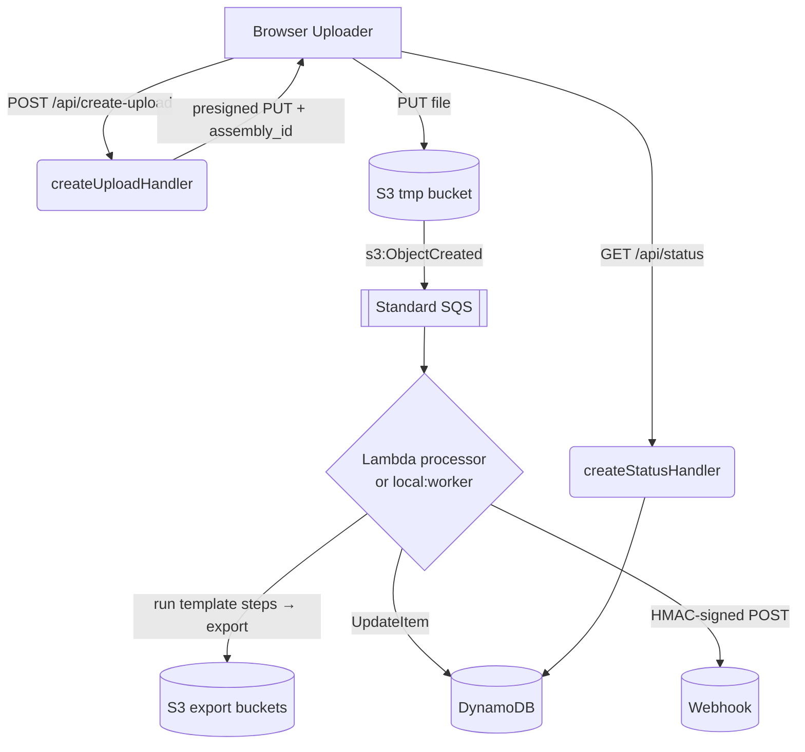

# Transflow

Serverless file processing pipelines on AWS — S3 + SQS + Lambda + DynamoDB — with a React uploader, deterministic templates, and a full LocalStack dev loop.

- 📦 Templated processing steps (FFmpeg or any binary baked into the Lambda image)
- 🔐 Presigned PUT uploads to a managed tmp bucket; explicit export-bucket allowlist
- 📬 SQS-driven processing with DLQ + reserved concurrency caps
- 🗂 DynamoDB as the source of truth for assembly status (with TTL)
- 🪝 Optional HMAC-signed webhook on completion
- ⚛️ `<Uploader>` and `<TransflowProvider>` React components
- 🧪 Run the entire pipeline locally against LocalStack — no AWS account needed
- 🚢 GitHub Actions for branch-based deploys and cleanup

## Architecture

Two flows depending on `sqs.fifo`:

**Default (`sqs.fifo: true`)** — S3 → Lambda bridge → FIFO SQS → Lambda processor.
Provides ContentBasedDeduplication so duplicate S3 events don't double-process,
at the cost of one extra Lambda invocation per upload.

```mermaid
flowchart TD
  A[Browser Uploader] -->|POST /api/create-upload| B(createUploadHandler)
  B -->|presigned PUT + assembly_id| A
  A -->|PUT file| C[(S3 tmp bucket\nuploads/{branch}/{assemblyId}/...)]
  C -->|s3:ObjectCreated| D{Lambda bridge}
  D -->|SendMessage| E[[FIFO SQS]]
  E --> F{Lambda processor}
  F -->|run template steps → export| H[(S3 export buckets)]
  F -->|UpdateItem| G[(DynamoDB)]
  F -->|HMAC-signed POST| I[(Webhook)]
  A -->|GET /api/status| J(createStatusHandler)
  J --> G
```

**Standard SQS (`sqs.fifo: false`, recommended for cost)** — S3 → SQS direct →
Lambda processor. One fewer Lambda invocation per upload; the handler merges
events that share an `assembly_id` so we don't race on DynamoDB.


```mermaid
flowchart TD
  A[Browser Uploader] -->|POST /api/create-upload| B(createUploadHandler)
  B -->|presigned PUT + assembly_id| A
  A -->|PUT file| C[(S3 tmp bucket)]
  C -->|s3:ObjectCreated| E[[Standard SQS]]
  E --> F{Lambda processor\nor local:worker}
  F -->|run template steps → export| H[(S3 export buckets)]
  F -->|UpdateItem| G[(DynamoDB)]
  F -->|HMAC-signed POST| I[(Webhook)]
  A -->|GET /api/status| J(createStatusHandler)
  J --> G
```

## Install

```bash
npm i @xnetcat/transflow
# or: bun add @xnetcat/transflow
```

Peer deps: `react@^18.3.1`, `react-dom@^18.3.1`. Node 18+.

## Configure (`transflow.config.js`)

Minimal config:

```js
module.exports = {
  project: "myproj",
  region: "us-east-1",
  s3: { exportBuckets: ["myproj-outputs"] },
  ecrRepo: "transflow-worker",
  lambdaPrefix: "transflow-worker-",
  templatesDir: "./templates",
  dynamoDb: { tableName: "TransflowJobs" },
  sqs: {},
  lambda: { memoryMb: 1024, timeoutSec: 300 },
};
```

The same file drives both production deploys and LocalStack — see [LocalStack](#run-fully-locally-against-localstack).

### All config fields

| Field | Default | Notes |
|---|---|---|
| `project` | required | Used to derive bucket and lambda role names. |
| `region` | required | AWS region (or LocalStack's mock region). |
| `endpoint` | `process.env.TRANSFLOW_AWS_ENDPOINT` | Custom endpoint URL. Setting this enables LocalStack mode (skips docker push, ECR lifecycle, reserved concurrency, STS). |
| `credentials` | SDK default chain | `{ accessKeyId, secretAccessKey, sessionToken? }`. Also reads `TRANSFLOW_AWS_ACCESS_KEY_ID` / `_SECRET_ACCESS_KEY`. |
| `s3.exportBuckets` | `[]` | Allowlist of buckets templates may export to. Created if missing. |
| `s3.maxFileSize` | unlimited | Server-side bytes guard rejected at presign. |
| `s3.allowedContentTypes` | unrestricted | Wildcards supported (`image/*`). |
| `s3.forcePathStyle` | `true` when `endpoint` is set | Required for LocalStack/MinIO. |
| `s3.corsAllowedOrigins` | `["*"]` | CORS `AllowedOrigins` on the tmp bucket. |
| `s3.tmpRetentionDays` | `7` | Lifecycle expiration on `uploads/` (set to 0 to disable). `outputs/` lives 4× as long. |
| `ecrRepo` | required | ECR repo name. |
| `ecr.retainImages` | `10` | Lifecycle policy keeps the last N image tags. |
| `lambdaPrefix` | required | Function name = `${lambdaPrefix}${branch}`. |
| `templatesDir` | required | Source dir of `.ts` template files. |
| `dynamoDb.tableName` | required | Single-table assembly store. |
| `dynamoDb.ttlDays` | `30` | Items get a `ttl` attribute; DDB TTL is enabled on first deploy. `0` disables. |
| `lambda.memoryMb` | required | 1769+ recommended for ffmpeg (1 full vCPU). |
| `lambda.timeoutSec` | required | Max 900s. |
| `lambda.architecture` | undefined | `"arm64"` or `"x86_64"`. ARM is ~20% cheaper. |
| `lambda.reservedConcurrency` | `10` | Hard cap. Set explicitly for high-traffic projects. |
| `lambda.maxBatchSize` | `10` | Jobs processed per Lambda invocation. |
| `sqs.queueName` | `${project}-processing[.fifo]` | Suffix forced from `sqs.fifo`. |
| `sqs.fifo` | `true` | Set `false` to halve invocations: S3 → SQS direct (no bridge). |
| `sqs.visibilityTimeoutSec` | `960` | Should exceed `lambda.timeoutSec`. |
| `sqs.maxReceiveCount` | `3` | Then → DLQ. |
| `sqs.batchSize` | `10` | SQS event-source mapping batch size. |

## Define a template

```ts
// templates/tpl_basic_audio.ts
import type { TemplateDefinition, StepContext } from "@xnetcat/transflow";

const tpl: TemplateDefinition = {
  id: "tpl_basic_audio",
  // Optional: webhook fired on completion (and on error)
  webhookUrl: process.env.TPL_WEBHOOK_URL,
  webhookSecret: process.env.TPL_WEBHOOK_SECRET, // signs as X-Transflow-Signature
  steps: [
    {
      name: "preview",
      async run(ctx: StepContext) {
        for (const input of ctx.inputsLocalPaths!) {
          const out = `${ctx.tmpDir}/preview_${input.split("/").pop()}.mp3`;
          await ctx.utils.execFF(["-i", input, "-t", "30", "-c:a", "libmp3lame", "-y", out]);
          await ctx.utils.exportToBucket!(out, `preview.mp3`, "myproj-outputs", "audio/mpeg");
        }
      },
    },
  ],
};
export default tpl;
```

`StepContextUtils` exposes:

- `execFF(args)` / `execProbe(args)` — run the bundled ffmpeg/ffprobe
- `uploadResult(localPath, key, contentType?)` — write to the configured output bucket under `outputs/{branch}/{uploadId}/{templateId}/{key}`
- `exportToBucket(localPath, key, bucketName, contentType?)` — write to any bucket in `s3.exportBuckets`
- `generateKey(basename)` — deterministic output key

Both `uploadResult` and `exportToBucket` populate `results[stepName]` in DynamoDB with an entry containing `ssl_url`, `size`, `mime`, etc. Templates are baked with esbuild (`bundle: true`, target Node 20), so dependencies are fine — just don't drag the entire `node_modules`.

## API routes (Next.js example)

```ts
// pages/api/create-upload.ts
import { createUploadHandler } from "@xnetcat/transflow";
import cfg from "../../transflow.config";
export default createUploadHandler(cfg);

// pages/api/status.ts
import { createStatusHandler } from "@xnetcat/transflow";
import cfg from "../../transflow.config";
export default createStatusHandler(cfg);
```

`createUploadHandler` accepts:

- single-file mode: `{ filename, contentType?, fileSize?, template, fields? }` → `{ assembly_id, upload_id, presigned_url }`
- batch mode: `{ files: [{ filename, contentType?, fileSize?, dir? }, ...], template, fields? }` → `{ assembly_id, upload_id, files: [{ filename, presigned_url }, ...] }`

`createStatusHandler` returns the full `AssemblyStatus` row from DynamoDB (404 if unknown).

## React client

```tsx
import { TransflowProvider, Uploader } from "@xnetcat/transflow/web";

// The Uploader component uses Tailwind CSS for styling.
<TransflowProvider endpoints={{ action: "/api/create-upload", status: "/api/status" }}>
  <Uploader
    template="tpl_basic_audio"
    multiple
    onAssembly={(id) => console.log("started", id)}
    onUpdate={(assembly) => console.log("status", assembly)}
  />
</TransflowProvider>;
```

The `Uploader` polls `endpoints.status` every 2s until `ASSEMBLY_COMPLETED` or 10 minutes, whichever comes first.

## Run fully locally against LocalStack

The whole pipeline runs on your laptop without an AWS account. The included `docker-compose.localstack.yml` brings up LocalStack 3.x; `transflow local:start` provisions buckets/queues/the DDB table; `transflow local:worker` plays the role of the Lambda.

```bash
# 1. start LocalStack
docker compose -f docker-compose.localstack.yml up -d --wait

# 2. bake your templates so the worker can find them
TRANSFLOW_AWS_ENDPOINT=http://localhost:4566 \
  npx transflow bake --config transflow.config.js --out .transflow-build

# 3. provision bucket / queue / table / S3 → SQS notification
TRANSFLOW_AWS_ENDPOINT=http://localhost:4566 \
  npx transflow local:start --config transflow.config.js

# 4. run the worker (replaces the Lambda) in another terminal
TRANSFLOW_AWS_ENDPOINT=http://localhost:4566 \
  npx transflow local:worker \
    --config transflow.config.js \
    --templates-index .transflow-build/templates.index.cjs

# 5. start your app
cd examples/next-app && npm run dev
```

LocalStack mode is selected by setting `TRANSFLOW_AWS_ENDPOINT` (or `cfg.endpoint`). It:

- skips docker login + push (no ECR needed)
- skips reserved concurrency, ECR lifecycle, IAM (which LocalStack community doesn't enforce)
- forces S3 path-style addressing
- substitutes account id `000000000000`
- generates `ssl_url` values that point at the LocalStack endpoint, so the URLs returned in `results[*]` are reachable from the host

For production, leave `TRANSFLOW_AWS_ENDPOINT` unset and `transflow deploy` does the real thing.

The `examples/next-app` directory has shortcuts: `npm run local:up`, `local:start`, `local:worker`, `local:down`, plus a `scripts/e2e-suite.mjs` integration test that exercises every flow.

## Deploy

GitHub Actions:

1. Create an AWS OIDC role; set secrets `AWS_ROLE_ARN`, `AWS_REGION`.
2. Copy `assets/workflows/deploy.yml` and `cleanup.yml` into `.github/workflows/`.

Manual:

```bash
npx transflow deploy \
  --branch $BRANCH \
  --sha $GITHUB_SHA \
  --config transflow.config.js \
  --yes
```

`deploy` is idempotent. It builds the Lambda image (only on changes if Docker buildx caches hit), pushes to ECR, ensures buckets/queue/DLQ/table exist, applies lifecycle/CORS/TTL, wires the S3 → Lambda or S3 → SQS notification, and updates the function code.

## CLI reference

| Command | Purpose |
|---|---|
| `transflow deploy --branch <b> --sha <s>` | Real-AWS deploy: ECR push + provisioning + Lambda update. |
| `transflow cleanup --branch <b> [--delete-storage] [--delete-ecr-images]` | Remove branch-scoped S3 prefixes and optionally ECR tags. |
| `transflow destroy [--force]` | Delete every resource for the project. Destructive. |
| `transflow bake --out <dir>` | Build `templates.index.cjs` + the runtime context locally. |
| `transflow local:run --file <path> --template <id> --out <dir>` | Run one template against a local file. No AWS. |
| `transflow local:start` | Provision LocalStack-side resources. |
| `transflow local:worker [--templates-index <path>]` | Long-lived SQS poller that runs the Lambda handler in-process. |
| `transflow check` | Print docker / aws-cli / Node availability. |

## Cost optimizations

`transflow deploy` applies these out of the box; relevant settings are documented in the config table above:

- **S3 lifecycle** on the tmp bucket — `uploads/` and `outputs/` expire automatically; orphaned multipart uploads are aborted after 1 day.
- **DynamoDB TTL** — every assembly record gets a `ttl` epoch; old rows stop being billed for storage.
- **ECR lifecycle** — keep last N images so storage doesn't grow per deploy.
- **Reserved Lambda concurrency** — capped at 10 by default to limit blast radius from a runaway upload burst.
- **Configurable CORS** — restrict the tmp bucket to your real origins.
- **`sqs.fifo: false`** — uses standard SQS so S3 events go straight into the queue. Roughly halves Lambda invocations per upload (no `S3→Lambda(bridge)→SQS` hop). Trade-off: no built-in dedupe for double-fire S3 events. Recommended for most production setups and required for the direct S3 → SQS notification used in `local:start`.

For ffmpeg specifically, **bumping `lambda.memoryMb` to 1769** allocates a full vCPU at the same $/CPU ratio — usually finishes faster *and* cheaper.

## Security

- Browser never sees AWS credentials. Only short-lived presigned PUT URLs.
- Tmp bucket and an explicit `s3.exportBuckets` allowlist; the handler refuses unknown buckets at runtime.
- DynamoDB is the source of truth for status. Webhooks are HMAC-signed (`X-Transflow-Signature: sha256=…`) when `webhookSecret` is set.
- `assembly_id` is 32 random bytes — unguessable.

## Releasing

Versioning is automated via [release-please](https://github.com/googleapis/release-please). Land commits on `main` using [Conventional Commits](https://www.conventionalcommits.org/):

- `feat: ...` → minor bump
- `fix: ...` → patch bump
- `feat!: ...` or a `BREAKING CHANGE:` footer → major bump
- `chore: …`, `docs: …`, `refactor: …`, `test: …`, `ci: …` → no bump (CHANGELOG only when not hidden)

Release-please watches `main` and opens a "release PR" with the version bump, generated CHANGELOG entries, and updated manifest. Merging that PR creates a `vX.Y.Z` tag, and the existing `publish.yml` workflow ships it to npm via Trusted Publishing (with provenance attestations) — no token required.

## Internals

- AWS SDK v3 throughout (no `aws-lambda` package).
- Lambda is image-based; ffmpeg is statically baked in. Templates are bundled with esbuild and loaded by id from `templates.index.cjs`.
- The `src/core/awsClients.ts` factory threads `endpoint`, `credentials`, and `forcePathStyle` through every client so tests, prod, and LocalStack share one code path.
- Status writes are `Update` only — no `Put` after the initial create — so concurrent updates on the same assembly merge cleanly.
- The handler de-duplicates S3 events that share an `assembly_id` before processing (cf. `src/lambda/handler.ts`).
