# Transflow Architecture

This document provides a comprehensive overview of Transflow's architecture, data flow, and deployment model.

## System Overview

Transflow is a serverless media processing pipeline that provides:

- Zero-config media transcoding using ffmpeg
- Branch-isolated deployments
- Real-time processing progress via SSE
- TypeScript-based processing templates
- Docker-containerized Lambda functions

## Architecture Diagram

```mermaid
graph TB
    %% Development Layer
    subgraph DEV["🔧 Development Environment"]
        DEV_CONFIG["transflow.config.js<br/>📝 Project Configuration"]
        DEV_TEMPLATES["templates/<br/>📁 TypeScript Templates<br/>(tpl_basic_audio.ts, etc.)"]
        DEV_NEXTJS["Next.js App<br/>🌐 Frontend Application"]
        DEV_CLI["CLI Tool<br/>⚙️ transflow command"]
    end

    %% Build & Bake Layer
    subgraph BAKE["🏭 Build Process"]
        BAKE_ESBUILD["esbuild<br/>📦 Bundle Templates"]
        BAKE_HANDLER["Lambda Handler<br/>🔌 Compiled Runtime"]
        BAKE_DOCKER["Docker Context<br/>🐳 Build Ready"]
        BAKE_INDEX["templates.index.cjs<br/>📋 Template Registry"]
    end

    %% GitHub Actions / CI
    subgraph CI["🚀 GitHub Actions"]
        CI_TRIGGER["Push to Branch<br/>📤 Git Push"]
        CI_BAKE["Bake Step<br/>🏭 Template Compilation"]
        CI_DEPLOY["Deploy Step<br/>🚀 Infrastructure Setup"]
        CI_CLEANUP["Cleanup Workflow<br/>🧹 Branch Deletion"]
    end

    %% AWS Infrastructure Layer
    subgraph AWS["☁️ AWS Cloud Infrastructure"]

        subgraph ECR_SECTION["📦 Container Registry"]
            ECR["Amazon ECR<br/>🐳 Docker Images<br/>transflow-worker:branch-sha"]
        end

        subgraph LAMBDA_SECTION["⚡ Compute"]
            LAMBDA["AWS Lambda<br/>🔥 Container Function<br/>transflow-worker-{branch}"]
            LAMBDA_ENV["Environment Variables<br/>📝 TRANSFLOW_BRANCH<br/>REDIS_URL, OUTPUT_BUCKET"]
        end

        subgraph STORAGE_SECTION["💾 Storage"]
            S3_UPLOAD["S3 Upload Bucket<br/>📤 uploads/{branch}/{uploadId}/"]
            S3_OUTPUT["S3 Output Bucket<br/>📥 outputs/{branch}/{uploadId}/"]
            S3_NOTIFICATION["S3 Event Notifications<br/>🔔 Object Created Events"]
        end

        subgraph DATA_SECTION["💽 Data Layer"]
            REDIS["Redis (Upstash)<br/>🔄 Real-time Streaming<br/>channel: upload:{branch}:{uploadId}"]
            DDB["DynamoDB (Optional)<br/>📊 Job Persistence<br/>TransflowJobs table"]
        end
    end

    %% Runtime / Client Layer
    subgraph RUNTIME["🌍 Runtime / Client"]
        BROWSER["Browser<br/>🖥️ User Interface"]
        UPLOADER["Uploader Component<br/>📤 File Upload Widget"]
        SSE["Server-Sent Events<br/>📡 Real-time Updates"]
        API_UPLOAD["API: create-upload<br/>🔗 Pre-signed URLs"]
        API_STREAM["API: stream<br/>📺 SSE Endpoint"]
    end

    %% Media Processing Flow
    subgraph PROCESSING["🎬 Media Processing"]
        FFMPEG["ffmpeg/ffprobe<br/>🎵 Media Tools"]
        TEMPLATE_EXEC["Template Execution<br/>⚙️ Custom Processing Steps"]
        PROGRESS["Progress Publishing<br/>📊 Step Updates"]
    end

    %% Development Flow
    DEV_CONFIG --> DEV_CLI
    DEV_TEMPLATES --> DEV_CLI
    DEV_CLI -->|"bake"| BAKE_ESBUILD

    %% Bake Process
    BAKE_ESBUILD --> BAKE_INDEX
    BAKE_ESBUILD --> BAKE_HANDLER
    BAKE_INDEX --> BAKE_DOCKER
    BAKE_HANDLER --> BAKE_DOCKER

    %% CI/CD Flow
    CI_TRIGGER --> CI_BAKE
    CI_BAKE --> CI_DEPLOY
    CI_DEPLOY --> ECR
    CI_DEPLOY --> LAMBDA
    CI_DEPLOY --> S3_UPLOAD
    CI_DEPLOY --> S3_OUTPUT
    CI_CLEANUP -.->|"branch delete"| LAMBDA
    CI_CLEANUP -.->|"optional"| S3_UPLOAD

    %% Deployment Flow
    BAKE_DOCKER -->|"docker build & push"| ECR
    ECR --> LAMBDA
    LAMBDA --> LAMBDA_ENV
    S3_UPLOAD --> S3_NOTIFICATION
    S3_NOTIFICATION --> LAMBDA

    %% Runtime Flow
    BROWSER --> UPLOADER
    UPLOADER --> API_UPLOAD
    API_UPLOAD -->|"pre-signed URL"| S3_UPLOAD
    S3_UPLOAD -->|"S3 Event"| LAMBDA

    %% Processing Flow
    LAMBDA --> TEMPLATE_EXEC
    TEMPLATE_EXEC --> FFMPEG
    TEMPLATE_EXEC --> PROGRESS
    TEMPLATE_EXEC -->|"uploadResult()"| S3_OUTPUT
    PROGRESS --> REDIS

    %% Real-time Updates
    REDIS --> API_STREAM
    API_STREAM --> SSE
    SSE --> BROWSER

    %% Optional DynamoDB
    LAMBDA -.->|"optional job tracking"| DDB

    %% Next.js Integration
    DEV_NEXTJS --> API_UPLOAD
    DEV_NEXTJS --> API_STREAM
    DEV_NEXTJS --> UPLOADER

    %% Branch Isolation
    S3_UPLOAD -.->|"prefix mode: uploads/{branch}/"| S3_UPLOAD
    S3_OUTPUT -.->|"prefix mode: outputs/{branch}/"| S3_OUTPUT
    S3_UPLOAD -.->|"bucket mode: {project}-{branch}"| S3_UPLOAD
```



## Component Breakdown

### 🔧 Development Layer

**Configuration (`transflow.config.js`)**

- Central configuration for AWS resources, S3 buckets, Lambda settings
- Environment-aware settings using process.env
- Supports both prefix and bucket isolation modes

**Templates (`templates/`)**

- TypeScript files defining media processing pipelines
- Each template exports a `TemplateDefinition` with steps
- Steps are async functions with access to `StepContext` utilities

**CLI Tool**

- `transflow bake` - Compiles templates via esbuild
- `transflow deploy` - Builds and deploys infrastructure
- `transflow cleanup` - Removes branch resources
- `transflow local:run` - Local testing with your ffmpeg

### 🏭 Build Process (Baking)

**Template Compilation**

- TypeScript templates → JavaScript modules via esbuild
- Creates `templates.index.cjs` registry mapping template IDs to modules
- All templates bundled into Docker build context

**Lambda Handler Bundling**

- Runtime handler compiled separately with external dependencies
- Optimized for cold start performance
- Includes all AWS SDK clients and Redis

**Docker Context Generation**

- Creates build-ready directory with templates, handler, package.json
- Copies Dockerfile from assets/
- Ready for `docker build` in CI/CD

### 🚀 CI/CD Pipeline

**Trigger (Git Push)**

- Every branch push triggers GitHub Actions workflow
- Branch name determines Lambda function naming
- Commit SHA used for Docker image tagging

**Bake Step**

- Runs `transflow bake` to compile templates
- Validates configuration and dependencies
- Prepares Docker build context

**Deploy Step**

- Builds Docker image with Node.js 20 + ffmpeg + libvips
- Pushes to ECR with tag `{branch}-{sha}`
- Creates/updates Lambda function per branch
- Configures S3 notifications and IAM permissions

**Cleanup Workflow**

- Triggered on branch deletion
- Removes Lambda function and S3 notifications
- Optionally cleans up storage and ECR images

### ☁️ AWS Infrastructure

**Container Registry (ECR)**

- Stores Docker images with media processing tools
- Images tagged with branch and commit SHA
- Supports both x86_64 and arm64 architectures

**Compute (Lambda)**

- Container functions named `{prefix}-{branch}`
- Environment variables for branch, Redis, S3 config
- Memory (128MB-10GB) and timeout (1-900s) configurable
- Triggered by S3 events, not direct invocation

**Storage (S3)**

- **Upload Bucket**: Receives files from pre-signed URLs
- **Output Bucket**: Stores processed results
- **Event Notifications**: Trigger Lambda on object creation
- **Branch Isolation**: Prefix (`uploads/{branch}/`) or bucket (`{project}-{branch}`) modes

**Data Layer**

- **SQS**: Messaging for processing (jobs) and progress (real-time updates)
- **DynamoDB**: Optional job persistence and metadata storage

### 🌍 Runtime & Client

**Browser Integration**

- Uploader component handles file selection and upload
- Server-Sent Events for real-time progress updates
- TransflowProvider for configuration context

**API Endpoints**

- `create-upload`: Generates pre-signed S3 URLs with metadata
- `stream`: SSE endpoint backed by SQS progress queue
- Both integrate seamlessly with Next.js API routes

**File Upload Flow**

1. Browser requests pre-signed URL with template ID
2. File uploaded directly to S3 with metadata
3. S3 event triggers Lambda function
4. Processing progress streamed via SQS → SSE

### 🎬 Media Processing

**Template Execution**

- Lambda downloads input files to `/tmp`
- Executes template steps in sequence
- Each step has access to ffmpeg, ffprobe, and utilities

**Progress Publishing**

- Real-time updates published to SQS progress queue (with channel field)
- Step start/completion, ffprobe output, errors
- Channel naming: `upload:{branch}:{uploadId}` for branch isolation

**Output Management**

- `uploadResult()` saves files to output bucket
- Automatic content-type detection
- Multiple outputs per template supported

## Data Flow

### 1. Development → Deployment

```
Templates (TS) → esbuild → JS modules → Docker context → ECR → Lambda
```

### 2. File Processing

```
Browser → Pre-signed URL → S3 Upload → S3 Event → Lambda → ffmpeg → S3 Output
```

### 3. Real-time Updates

```
Lambda Progress → SQS Progress Queue → SSE Endpoint → Browser EventSource
```

## Branch Isolation

Transflow uses **shared resources with branch isolation** - a single SQS (processing + progress) and DynamoDB table serve all branches while maintaining complete data separation.

### S3 Storage Isolation

**Prefix Mode (Default)**

- Single upload and output buckets shared across branches
- Files organized by prefix: `uploads/{branch}/{uploadId}/`
- Lambda functions: `{prefix}-{branch}`
- S3 notifications scoped to branch prefix

**Bucket Mode**

- Separate bucket per branch: `{project}-{branch}`
- Both uploads and outputs use same bucket
- Lambda functions: `{prefix}-{branch}`
- Full bucket isolation for security/compliance

### Redis Channel Isolation

**Branch-Aware Channels**

- Format: `upload:{branch}:{uploadId}`
- Example: `upload:main:abc123`, `upload:feature-x:def456`
- Prevents cross-branch message collision
- Single Redis instance serves all branches

**SSE Endpoint Support**

```
# Listen to specific upload
/api/stream?channel=upload:main:abc123

# Listen to all uploads for a branch
/api/stream?branch=main
```

### DynamoDB Key Isolation

**Composite Key Structure**

- Primary Key: `branch#uploadId` (e.g., `main#abc123`)
- Sort Key: `uploadId`
- Branch attribute for queries
- Single table with complete branch separation

**Benefits**

- Cost-effective: One table vs many
- Cross-branch analytics possible
- Consistent backup/monitoring
- Simplified infrastructure management

## Scaling & Performance

**Cold Start Optimization**

- Templates baked into image (zero config fetching)
- Optimized Docker layers for faster pulls
- External dependencies cached in Lambda environment

**Concurrency**

- Each upload gets unique Lambda invocation
- S3 events provide natural load distribution
- Redis pub/sub scales horizontally

**Resource Management**

- Configurable memory (affects CPU allocation)
- Timeout prevents runaway processes
- Automatic cleanup of `/tmp` files

## Security Model

**IAM Roles**

- Deploy role: ECR, Lambda, S3, IAM pass-role permissions
- Execution role: S3 get/put, CloudWatch logs, optional DynamoDB
- Principle of least privilege with resource-specific policies

**Data Isolation**

- Branch-scoped S3 prefixes/buckets
- Lambda environment variables per branch
- Redis channels namespaced by upload ID

**Network Security**

- VPC deployment optional
- S3 pre-signed URLs with expiration
- Redis over TLS (Upstash default)

This architecture enables scalable, branch-isolated media processing with real-time feedback, perfect for Next.js applications requiring robust media handling capabilities.
