# Transflow Architecture

This document provides a comprehensive overview of Transflow's modern, production-ready architecture with shared resources and DynamoDB-based status tracking.

## System Overview

Transflow is a serverless media processing pipeline that provides:

- Zero-config media transcoding using ffmpeg
- Shared AWS resources with logical branch isolation
- Real-time status tracking via DynamoDB polling
- Deterministic job IDs for reliable status checking
- TypeScript-based processing templates
- Docker-containerized Lambda functions
- Optional webhook notifications with retries and HMAC signing

## Architecture Diagram

```mermaid
graph TB
    %% User Layer
    subgraph USER["👤 User Layer"]
        BROWSER["Browser<br/>🖥️ User Interface"]
        NEXTJS["Next.js App<br/>🌐 Frontend Application"]
        CLIENT["Client Libraries<br/>📚 React Components"]
    end

    %% API Layer
    subgraph API["🔌 API Layer"]
        API_UPLOAD["Upload API<br/>📤 /api/create-upload<br/>Pre-signed URLs + Assembly ID"]
        API_STATUS["Status API<br/>📊 /api/status<br/>DynamoDB Polling"]
        API_STATUS_LAMBDA["Status Lambda API<br/>⚡ Direct Lambda Invoke<br/>Optional Webhook Trigger"]
    end

    %% AWS Shared Infrastructure
    subgraph AWS["☁️ AWS Infrastructure (Shared)"]

        subgraph CONTAINER_SECTION["📦 Container Registry"]
            ECR["Amazon ECR<br/>🐳 Single Repository<br/>transflow-worker"]
        end

        subgraph COMPUTE_SECTION["⚡ Compute"]
            LAMBDA_MAIN["Main Lambda<br/>🔥 Processing Function<br/>Container-based"]
            LAMBDA_STATUS["Status Lambda<br/>📊 User-facing Status API<br/>(Optional)"]
        end

        subgraph STORAGE_SECTION["💾 Storage"]
            S3_BUCKETS["S3 Buckets<br/>📤 Explicit bucket list in config<br/>Prefix-based branch isolation<br/>NEVER deleted"]
            S3_NOTIFICATION["S3 Event Notifications<br/>🔔 Object Created → SQS"]
        end

        subgraph DATA_SECTION["💽 Data Layer"]
            SQS_QUEUE["SQS FIFO Queue<br/>🚀 Single processing queue<br/>+ Dead Letter Queue"]
            DYNAMODB["DynamoDB Table<br/>📊 Single table for all branches<br/>assembly_id as primary key"]
        end
    end

    %% External Services
    subgraph EXTERNAL["🌐 External Services"]
        WEBHOOK["Webhook Endpoints<br/>🔔 Optional notifications<br/>HMAC signed"]
    end

    %% Development Flow
    subgraph DEV["🔧 Development"]
        CONFIG["transflow.config.js<br/>📝 Shared resource config"]
        TEMPLATES["templates/<br/>📁 TypeScript processing logic"]
        CLI["CLI Tool<br/>⚙️ Bake, Deploy, Status"]
    end

    %% Processing Flow
    BROWSER --> API_UPLOAD
    API_UPLOAD -->|"Assembly ID"| BROWSER
    API_UPLOAD -->|"Pre-signed URL + Metadata"| S3_BUCKETS
    S3_BUCKETS -->|"S3 Event"| S3_NOTIFICATION
    S3_NOTIFICATION --> SQS_QUEUE
    SQS_QUEUE --> LAMBDA_MAIN

    %% Status Flow
    BROWSER -->|"Poll every 2-5s"| API_STATUS
    API_STATUS --> DYNAMODB
    DYNAMODB --> API_STATUS
    API_STATUS --> BROWSER

    %% Direct Status Lambda Flow
    CLIENT -.->|"Optional direct calls"| API_STATUS_LAMBDA
    API_STATUS_LAMBDA --> DYNAMODB
    API_STATUS_LAMBDA -.->|"Optional trigger"| WEBHOOK

    %% Processing Flow
    LAMBDA_MAIN --> DYNAMODB
    LAMBDA_MAIN -->|"Upload results"| S3_BUCKETS
    LAMBDA_MAIN -.->|"Optional webhooks"| WEBHOOK

    %% Development Flow
    CONFIG --> CLI
    TEMPLATES --> CLI
    CLI -->|"Bake & Deploy"| ECR
    ECR --> LAMBDA_MAIN
    ECR -.-> LAMBDA_STATUS

    %% Branch Isolation (Logical)
    S3_BUCKETS -.->|"Prefix: uploads/{branch}/"| S3_BUCKETS
    DYNAMODB -.->|"Key: assembly_id (includes branch)"| DYNAMODB
    SQS_QUEUE -.->|"Shared queue, branch in metadata"| SQS_QUEUE
```



## Core Principles

### 1. **Shared Resources**

- **Single Lambda function** serves all branches
- **Single SQS queue** handles all processing jobs
- **Single DynamoDB table** stores all job statuses
- **Single ECR repository** stores container images
- **Cost-effective** and **simplified infrastructure**

### 2. **Logical Branch Isolation**

- **S3 prefixes**: `uploads/{branch}/`, `outputs/{branch}/`
- **Assembly IDs**: Include branch context in deterministic hash
- **DynamoDB keys**: `assembly_id` contains branch information
- **Complete data separation** without resource duplication

### 3. **Deterministic Job IDs**

```typescript
// Single file
assembly_id = sha256(md5(file) + templateId + userId);

// Batch files
assembly_id = sha256(joined_md5s + templateId + userId);
```

### 4. **Status-First Design**

- **DynamoDB as single source of truth** for all job status
- **Assembly-based tracking** with Transloadit-like rich status data
- **No real-time streams** - simple polling every 2-5 seconds
- **Deterministic lookups** - status always available by assembly_id

## Component Breakdown

### 🔧 Development Layer

**Configuration (`transflow.config.js`)**

- Central configuration for all AWS resources
- **Explicit S3 bucket list** - buckets are created but never deleted
- **Shared resource definitions** - single Lambda, SQS, DynamoDB for all branches
- **JavaScript/CJS/MJS support** for dynamic configuration

**Templates (`templates/`)**

- TypeScript files defining media processing pipelines
- Each template exports a `TemplateDefinition` with steps and optional webhook config
- Steps are async functions with access to `StepContext` utilities
- **Optional webhook URL and secret** for post-processing notifications

**CLI Tool**

- `transflow bake` - Compiles templates via esbuild
- `transflow deploy` - Deploys shared infrastructure to AWS
- `transflow cleanup` - Cleans branch-specific S3 prefixes only
- `transflow status` - Check job status by assembly ID (optional)

### ☁️ AWS Infrastructure (Shared)

**Container Registry (ECR)**

- Single repository: `{project}-worker`
- Images tagged with branch and commit SHA
- Shared across all branches for cost efficiency

**Compute (Lambda)**

- **Main Processing Lambda**: Handles S3 events and SQS processing
- **Optional Status Lambda**: Dedicated user-facing status API
- **Shared functions** serve all branches with branch context from metadata
- **Event source mapping** from single SQS queue to main Lambda

**Storage (S3)**

- **Explicit bucket management**: Listed in config, created if missing, never deleted
- **Prefix-based isolation**: `uploads/{branch}/`, `outputs/{branch}/`
- **User isolation** (optional): `uploads/{branch}/users/{userId}/`
- **Event notifications**: S3 → SQS for reliable processing

**Data Layer**

- **SQS**: Single FIFO processing queue + DLQ for all branches
- **DynamoDB**: Single table with `assembly_id` primary key containing all job data
- **No Redis**: Eliminated completely in favor of DynamoDB polling

### 🌍 Runtime & Client

**Browser Integration**

- Uploader component with real-time status polling
- Status updates via REST API calls to DynamoDB
- Rich UI showing uploads, results, progress, and timing
- **No EventSource/SSE** - simple fetch() polling every 2-5 seconds

**API Endpoints**

- `create-upload`: Generates pre-signed S3 URLs + deterministic assembly_id
- `status`: Polls DynamoDB for current job status by assembly_id
- `status-lambda` (optional): Direct Lambda invocation for status checking

### 🎬 Media Processing

**Job Processing Flow**

1. **File Upload**: Direct to S3 with metadata (uploadId, templateId, assemblyId, userId)
2. **S3 Event**: Triggers SQS message to processing queue
3. **Lambda Processing**: Downloads files, runs template steps, uploads results
4. **Status Updates**: Updates DynamoDB with progress, results, timing data
5. **Webhook Notifications**: Optional POST to configured endpoints with retries

**Assembly Status Schema (Transloadit-like)**

```typescript
{
  assembly_id: "abc123...",
  ok: "ASSEMBLY_COMPLETED" | undefined,
  error: string | undefined,
  message: string,
  uploads: Array<{
    id: string,
    name: string,
    size: number,
    mime: string,
    md5hash: string,
    // ... metadata
  }>,
  results: {
    [stepName]: Array<{
      id: string,
      name: string,
      size: number,
      ssl_url: string,
      original_id: string,
      // ... metadata
    }>
  },
  bytes_expected: number,
  bytes_received: number,
  bytes_usage: number,
  execution_duration: number,
  execution_start: string,
  created_at: string,
  updated_at: string,
  user: { userId: string },
  template_id: string,
  branch: string
}
```

## Data Flow

### 1. File Upload Flow

```
Browser → create-upload API → Pre-signed URL + assembly_id → S3 Upload (with metadata)
```

### 2. Processing Flow

```
S3 Event → SQS Queue → Main Lambda → Template Steps → Results to S3 → DynamoDB Status Update → Optional Webhook
```

### 3. Status Checking Flow

```
Browser → status API → DynamoDB → Assembly Status → UI Update
```

### 4. Optional Status Lambda Flow

```
Client → Status Lambda → DynamoDB → Response (+ Optional Webhook Trigger)
```

## Branch Isolation Model

### Shared Resources (Cost Effective)

- **1 Lambda function** processes all branches
- **1 SQS queue** handles all jobs
- **1 DynamoDB table** stores all statuses
- **1 ECR repository** stores all images

### Logical Isolation (Complete Data Separation)

- **S3 Prefixes**: `uploads/{branch}/`, `outputs/{branch}/`
- **Assembly IDs**: Deterministic hash includes branch context
- **DynamoDB Keys**: `assembly_id` provides branch isolation
- **Metadata**: Branch information in S3 object metadata

### Security Benefits

- **No cross-branch access**: Users only see their assemblies
- **Path-based isolation**: S3 bucket policies enforce user directories
- **Deterministic job IDs**: Consistent status lookups
- **Authentication required**: JWT validation for all operations

## Key Advantages

### 1. **Simplified Architecture**

- **No Redis management** - eliminated completely
- **No SSE complexity** - simple REST polling
- **Single DynamoDB table** - one source of truth
- **Fewer moving parts** - easier to debug and monitor

### 2. **Cost Optimization**

- **Shared infrastructure** across all branches
- **No per-branch resources** - eliminates waste
- **Pay-per-use DynamoDB** - only pay for active jobs
- **Efficient polling** - 2-5 second intervals vs real-time streams

### 3. **Production Reliability**

- **Deterministic job tracking** - assembly_id always works
- **Rich status data** - complete job information in single response
- **Webhook resilience** - retries with exponential backoff
- **Authentication built-in** - JWT validation and ownership checks

### 4. **Developer Experience**

- **Simple status polling** - easy to implement in any frontend
- **Rich debugging data** - detailed execution information
- **Optional direct Lambda calls** - bypasses web layer if needed
- **Comprehensive error handling** - clear error messages and codes

## Performance Characteristics

**Cold Start**: ~1-2s for main Lambda, ~500ms for status Lambda  
**Warm Execution**: ~100-500ms processing, ~10-50ms status lookups  
**Polling Overhead**: Minimal with 2-5s intervals  
**Concurrent Users**: Scales automatically with Lambda concurrency  
**Data Consistency**: Strong consistency with DynamoDB

This architecture provides a robust, cost-effective, and maintainable foundation for serverless media processing at any scale.
